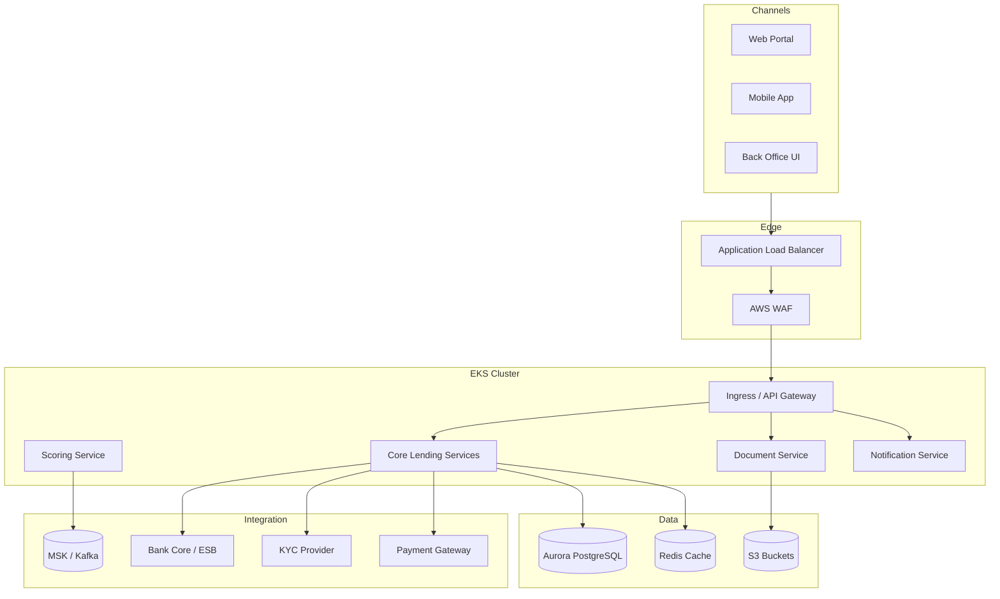

# Solution Architecture Reference – Digital Lending on AWS

This document provides a concrete reference architecture for a digital lending platform. It is deliberately specific so that architects, security teams and vendors can reason about trade-offs.

---

## 1. High-Level Diagram (Mermaid)

---

## 2. Service Responsibilities

- **Core Lending Services**
  - Application intake and validation.
  - Offer generation and pricing.
  - Contract creation and lifecycle.
  - Repayment schedule management.

- **Scoring Service**
  - Orchestration of internal and external scoring engines.
  - Mapping of raw scores to lending decisions and limits.
  - Feature store style patterns for re-usable risk signals.

- **Document Service**
  - Document upload, virus scanning and classification.
  - Secure storage and access logging.
  - Optional OCR and data extraction.

- **Notification Service**
  - Email/SMS/push notification dispatch.
  - Idempotent delivery and retry policies.
  - Templates and localisation.

Each service exposes synchronous APIs and publishes domain events to Kafka for downstream consumers (analytics, collections, reporting).

---

## 3. Integration Patterns

We use a small, consistent set of patterns:

- **Synchronous APIs for customer-facing flows:**
  - REST/JSON over HTTPS for portal and mobile.
  - gRPC is considered only for internal high-throughput use cases.

- **Asynchronous events for decoupling:**
  - Domain events (`ApplicationSubmitted`, `OfferAccepted`, `LoanActivated`) published to Kafka topics.
  - Downstream services subscribe and react without coupling back to the source.

- **Adapters for external systems:**
  - One adapter per external integration (core banking, KYC, payments).
  - Mapping, retries, back-off and idempotency implemented in the adapter.
  - Contract tests validate expectations about external APIs.

---

## 4. Data Ownership and Schema Strategy

- Each domain service owns its own schema or schema namespace.
- Shared read models can be materialised for reporting or dashboards.
- For bank environments with an existing enterprise data warehouse:
  - We focus on publishing clean, well-defined events,
  - DWH teams can subscribe or ingest as needed.

We explicitly avoid a single massive “shared” application database for everything.

---

## 5. Non-Functional Design Hooks

The architecture is designed to be aligned with the NFR baseline:

- Stateless services and autoscaling to meet latency and throughput.
- Multi-AZ deployments and DR replication.
- Network segmentation between ingress, app and data tiers.
- Observability hooks for logs, metrics and traces.

Detailed configuration is documented in:

- NFR response document.
- Infrastructure-as-Code (Terraform) modules.
- Architecture Decision Records (ADRs).

---

## 6. Evolution Scenarios

The architecture is intentionally simple to start with, but has clear paths to evolve:

- Split core services further by sub-domain as teams grow.
- Introduce separate read/write models for specific products.
- Add additional channels (for example partner APIs) without rewriting core logic.

These changes are facilitated by keeping clear boundaries and by favouring events for cross-domain communication.
